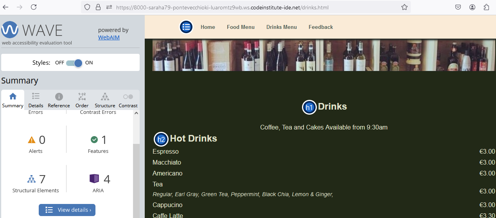
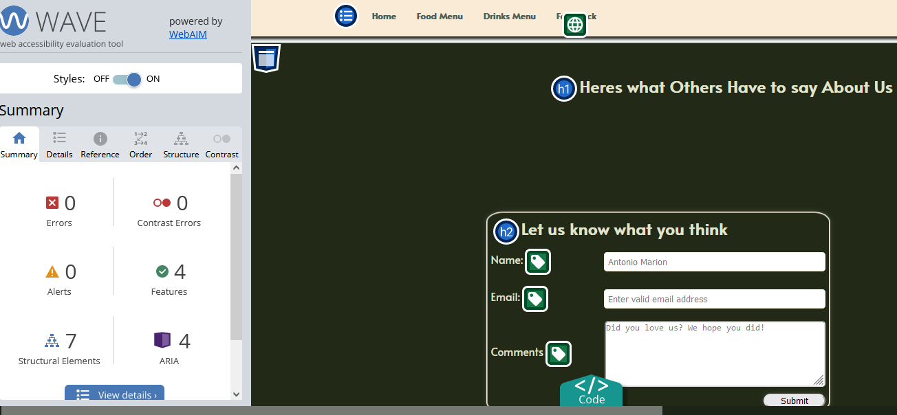

# Ponte Vecchio Killaloe

Ponte Vecchio Killaloe is a site created for use by the Ponte Vecchio cafe in Killaloe County Clare.
Previosly the cafe had no website to either promote or showcase information about their food and business.

With this site the main aim was to create a space where people can view the menus and leave feedback while providing links to social media outlets for up to date posts.

 

[Link to live site](https://saraha79.github.io/ponte-vecchio-killaloe)

---

## CONTENTS

* [User Experience](#user-experience-ux)
  * [User Stories](#user-stories)

* [Design](#design)
  * [Colour Scheme](#colour-scheme)
  * [Typography](#typography)
  * [Imagery](#imagery)

* [Features](#features)
  * [General Features on Each Page](#general-features-on-each-page)
  * [Future Implementations](#future-implementations)
  * [Accessibility](#accessibility)

* [Technologies Used](#technologies-used)
  * [Languages Used](#languages-used)
  * [Frameworks, Libraries & Programs Used](#frameworks-libraries--programs-used)

* [Deployment & Local Development](#deployment--local-development)
  * [Deployment](#deployment)
  * [Local Development](#local-development)
    * [How to Fork](#how-to-fork)
    * [How to Clone](#how-to-clone)

* [Testing](#testing)

* [Credits](#credits)
  * [Code Used](#code-used)
  * [Content](#content)
  * [Media](#media)
  * [Acknowledgments](#acknowledgments)

---

### User Stories
### User Experience (UX) for Ponte Vecchio Cafe, Deli, and Wine Store

#### Initial Discussion
Ponte Vecchio Cafe, Deli, and Wine Store is a charismatic establishment that offers a unique blend of Italian culinary delights and fine wines. With an increasing focus on sustainability and growing customer interest, the owner is spending significant investment in creating a more eco friendly aspect to the cafe’s offerings and how to participate in various events and promotions.

The owners of Ponte Vecchio Cafe, Deli, and Wine Store, are committed to promoting sustainability and reducing their environmental footprint. To achieve this, they want to encourage the use of reusable items within their establishment. This involves providing customers with reusable utensils, cups, and containers to minimize waste. With htis in mind, transitioning to online menus is a priority. This digital shift not only helps reduce paper waste but also allows for easy updates to the menus and share the latest offerings and specials more efficiently. By adopting these practices, we aim to create a more sustainable and environmentally friendly experience for our customers.

#### Key Information for the Site
- **Introduction to Ponte Vecchio**: Highlighting the menu items, deli, and bookstore.
- **Feedback area**: a place where users can provide feedback for the owners.
- **food Menu**: Easy access for customers to see what food is on offer.
- **Drinks Menu**:Easy access for customers to see what drinks are on offer.

#### User Stories

**Client Goals**
- Ensure the website is accessible and user-friendly on various device sizes.
- Simplify the process for potential customers to view the menus before arrival.
- Clearly display current menu options in a way that all customers can view.
- Provide an easy way for customers to contact the cafe with questions, feedback, or recommendations.

**First Time Visitor Goals**
- Understand what Ponte Vecchio Cafe, Deli, and Wine Store is and how to engage with it.
- Navigate the site easily to find relevant information.
- Locate the cafe’s social media profiles for more updates and interactions.

**Returning Visitor Goals**
- Access up-to-date information on current specials where updated and event when added.
- Easily contact the cafe with any questions or suggestions.

**Frequent Visitor Goals**
- Recommend new products or events for the cafe to consider.
- review menu options as desired

This user-centric approach ensures that all visitors, have a pleasant, seamless and informative experience that enhances their connection with Ponte Vecchio Cafe, Deli, and Wine Store.
## Design and Color Scheme
Design was heavily focused on creating a seamless transition from the current pape based menu design so by using the altera font througout was important as was following the menu color scheme of darkolive tones and complimentary contrasting colours

Add all information about your colour scheme for your site here. You can explain why you choose the colours you did?

### Typography

font used was the alata font as this was te font previously used on the menu.
 

### Imagery

imagry used was acombination of owner supplied photos and AI generated creations for a striking harmony that envokes a warm and mouthwatering feeling for the service users. 

## Features
- Homepage

- Food Menu

- Drinks Menu

- Feedback Form

 - thank you response page with link back to home

### General features on each page

Each page has a Navigation bar at the top that stays in position and a footer with address and social links
-Navigation Bar

-Footer

### Future Implementations

As part of future development the following will be added.

- A photo gallery of events, food and other relevant photos
- A daily specials section
- Feedback from customers for users to see what others have said

### Accessibility

Accessibility has been an important factor within the page so labels, fonts and colors have been utilized throughout with wave validation testing completed as below:
- Homepage

- Food Menu

- Drinks Menu
)

- Feedback

## Technologies Used

### Languages Used
- HTML
- CSS.

### Frameworks, Libraries & Programs Used

Git - For version control.

Github - To save and store the files for the website.

favicon.io - To create a custom favicon 

Google Fonts - To import the fonts used on the website.

Font Awesome - For the iconography on the website.

Google Dev Tools - To troubleshoot and test features, solve issues with responsiveness and styling.

Am I Responsive? To show the website image on a range of devices.

### Validator Testing 

- HTML
  - No errors were returned when passing through the official [W3C validator](https://validator.w3.org/nu/?doc=https%3A%2F%2Fsaraha79.github.io%2Fponte-vecchio-killaloe%2F)
- CSS
  - No errors were found when passing through the official [(Jigsaw) validator](https://jigsaw.w3.org/css-validator/validator?uri=https%3A%2F%2Fsaraha79.github.io%2Fponte-vecchio-killaloe&profile=css3svg&usermedium=all&warning=1&vextwarning=&lang=en)

  

### Unfixed Bugs
Feedback form not centered on large screen.

## Deployment
 
- The site was deployed to GitHub pages at the start using steps as follows:
  - In the GitHub repository, navigate to the Settings tab 
  - From the source section drop-down menu, select the Master Branch
  - Once the master branch has been selected, the page will be automatically refreshed with a detailed ribbon display to indicate the successful deployment. 

The live link can be found here - https://code-institute-org.github.io/love-running-2.0/index.html

### Local Development

The local development section gives instructions on how someone else could make a copy of your project to play with on their local machine. This section will get more complex in the later projects, and can be a great reference to yourself if you forget how to do this.

#### How to Fork

Place instructions on how to fork your project here.

#### How to Clone

Place instructions on how to clone your project here.

## Testing
- HTML W3C 

## Manual Testing

Features	Expected Outcome	Test Performed	Results	Pass/Fail
Navbar				

#### Home	when clicked, the page should scroll up to the top or back to home from all other pages
 -	Clicked "Home" on the Navbar and Page reloaded to the Home Page -	Pass

#### Food menu	when clicked, the page should scroll up to top of page or load the Food Menu
- Clicked "Food Menu" in the Navbar	Page scrolled up and down to the Traits section	Pass
#### Drinks menu	when clicked, the page should scroll up to the top or back to home from all other pages
 -	Clicked "Drinks menu" on the Navbar and the page reloaded to the Drinks menu -	Pass

#### Feedback	when clicked, the page should load or refresh form
- Clicked "Feedback" in the Navbar and page reloaded or opened feedback form	Pass

#### Input data into feedback form and submit successfully
- Input of all data correctly results in a thank you page displayed with a close link that on click returns to the homepage
incorrect input or omition of any field results in prompt error to display asking for the field/s to be filled in. Pass

#### Facebook icon takes the user to the facebook page of Ponte Vecchio in new tab
- clicked link Icon and a new tab with Ponte Vechio page loads  pass

#### Istagram icon link takes the user to the Instagram page in a new tab
- clicked link Icon and a new tab with Ponte Vechio page loads  pass 

## Credits
Inspiration from love running coders, fresh eyes from fellow students such all george P and Vernell Clark when I have been stuck on getting parts to work and many youTube channels including leela Web dev, FollowAndrew and Kevin Powell for expert tips and tricks with css, git and html.

### Code Used

If you have used some code in your project that you didn't write, this is the place to make note of it. Credit the author of the code and if possible a link to where you found the code. You could also add in a brief description of what the code does, or what you are using it for here.

### Content

Content for the page has been writte by the owners of Ponte Vecchio, myself and inspired/checked by chatGPT4o

###  Media

Images supplied by Eilish at Ponte Vechio and AI generated pizza on chatGPT.
  
###  Acknowledgments
Thanks go to Dick Vaanderen CI project tutor for guidance, Vernell Clark for huddles and experienced CI student eyes and pointing out my flaws in code and peer review.

